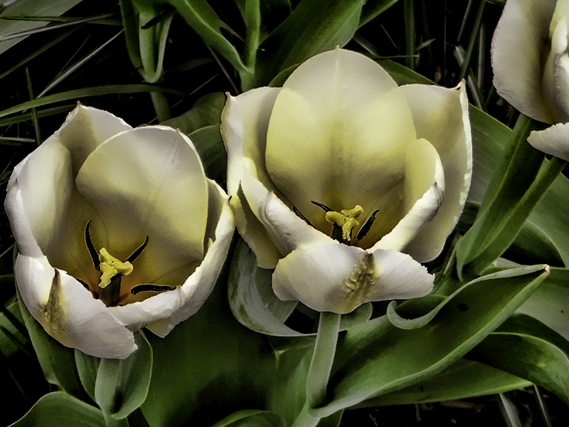
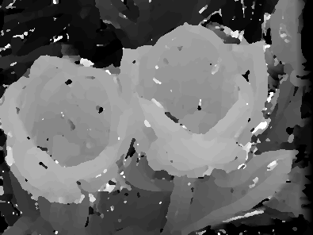

# Stereopsis-correlation

### Depth map estimation using a correlation approach to stereopsis

### Prerequisites
--

* Python 3
* Rectified Stereo Images

### Dataset
--

Test set of Flickr1024, **[dataset](https://yingqianwang.github.io/Flickr1024/)**.

### Usage

'''
python correlation.py
'''

### Results

   

