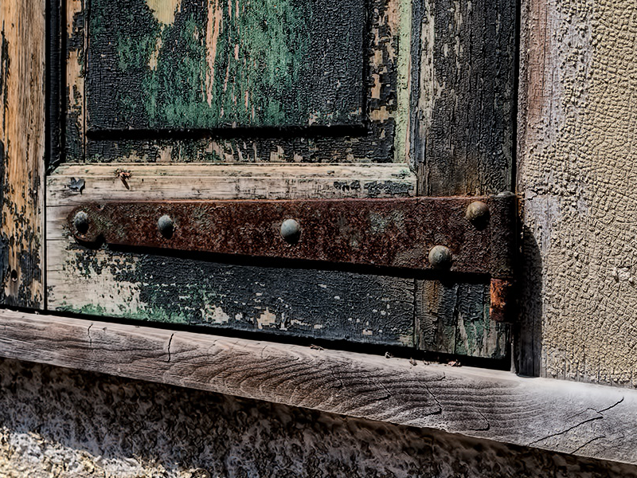
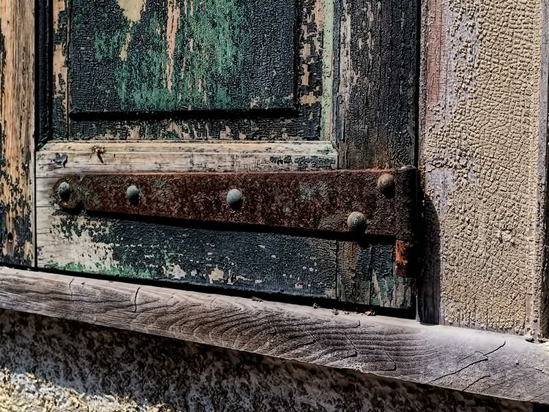
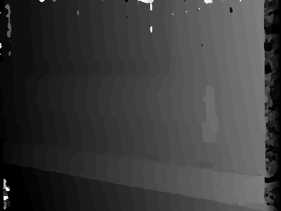
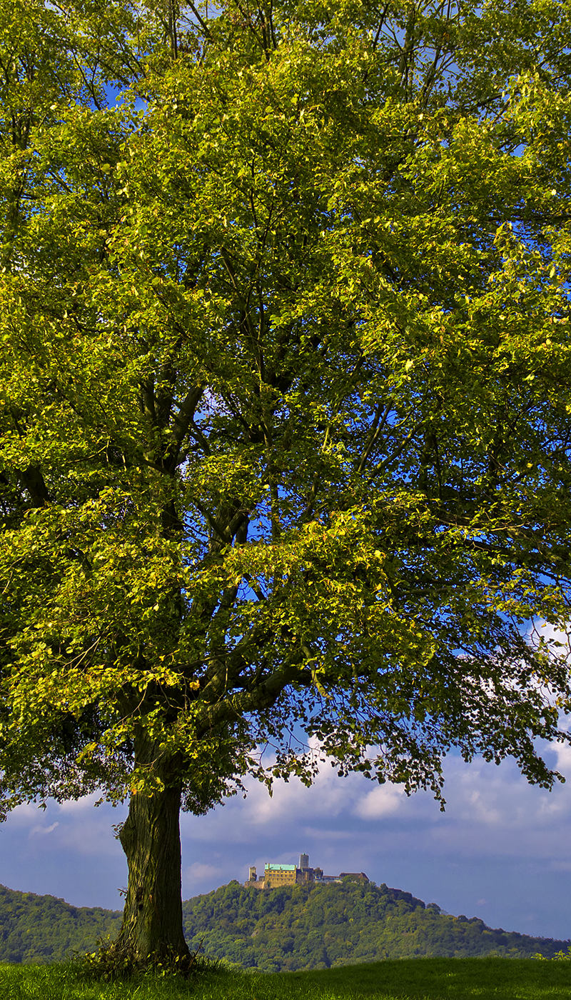
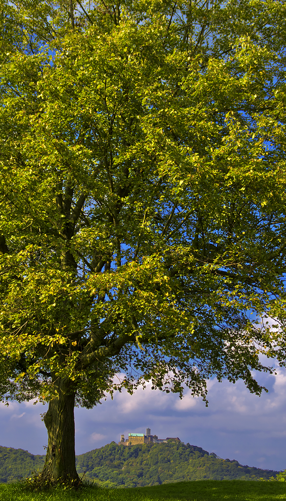
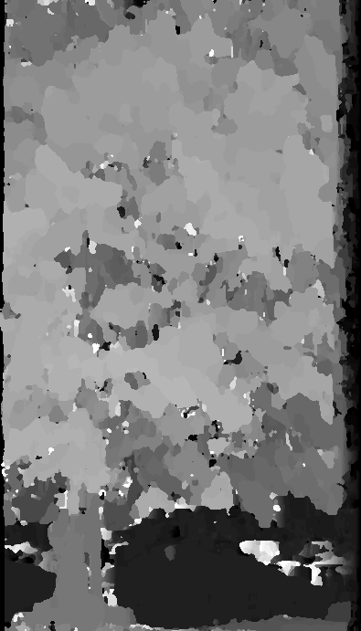
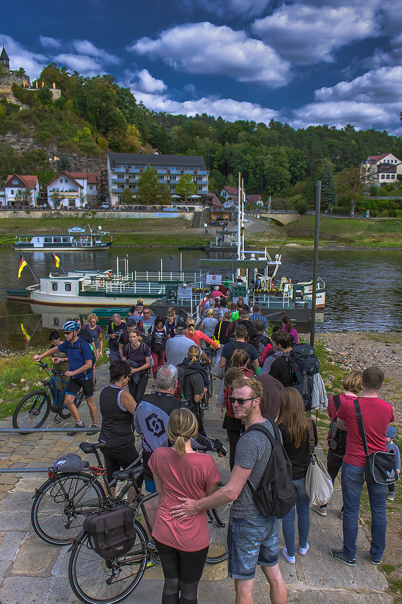
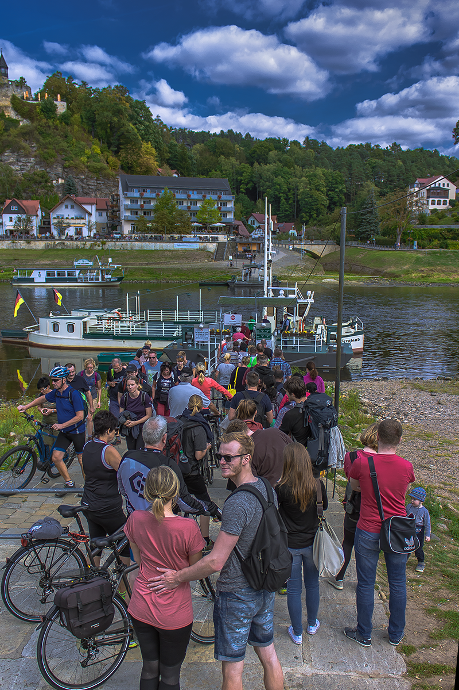
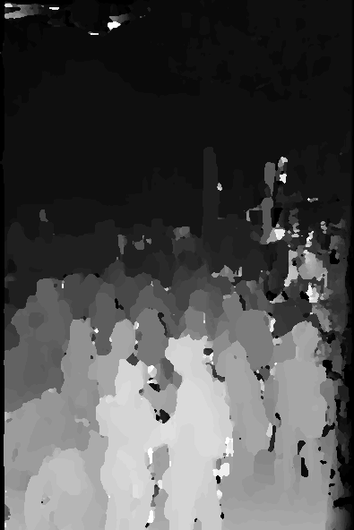

# Stereopsis-correlation

### Depth map estimation using a correlation approach to stereopsis

### Prerequisites
---

* Python 3
* Rectified Stereo Images

### Dataset
---

Test set of Flickr1024, **[dataset](https://yingqianwang.github.io/Flickr1024/)**.

### Usage

Run the following command

```
python correlation.py
```

### Results
---
   

   

   

   
